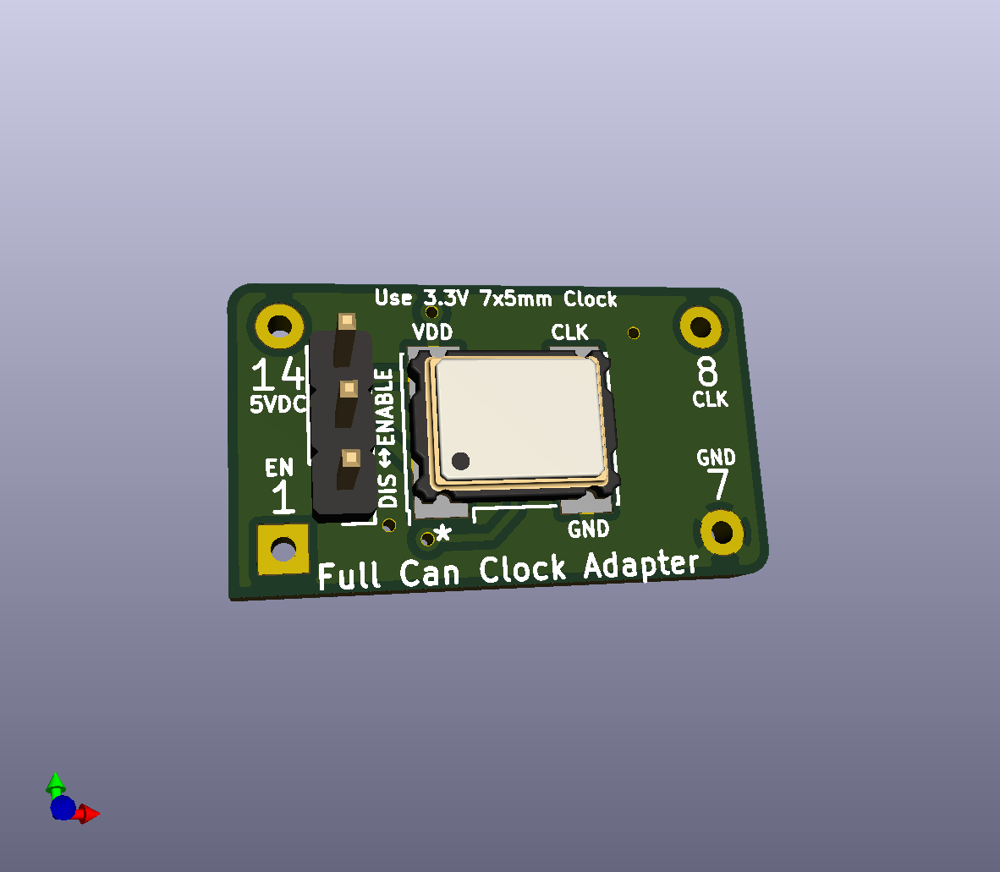
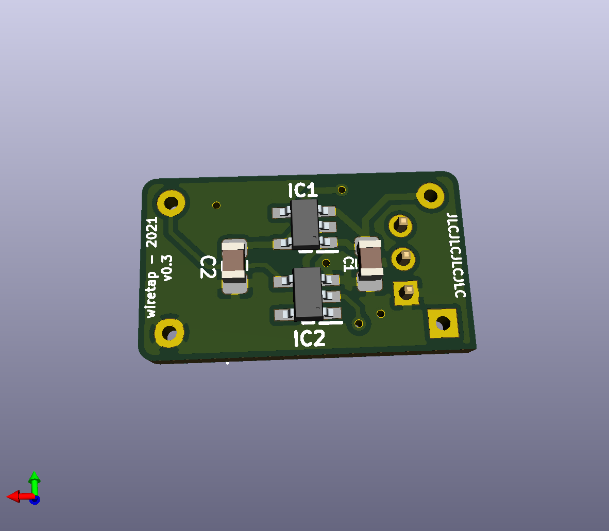

# Full Can SMD Crystal Oscillator
A full can crystal oscillator replacement using 3.3V SMD components for 5V systems.

\

## Info
This board is a full can crystal oscillator replacement for 5V systems. It uses 3.3v SMD components. It also features an enable/disable pin if your parent board requires it.
